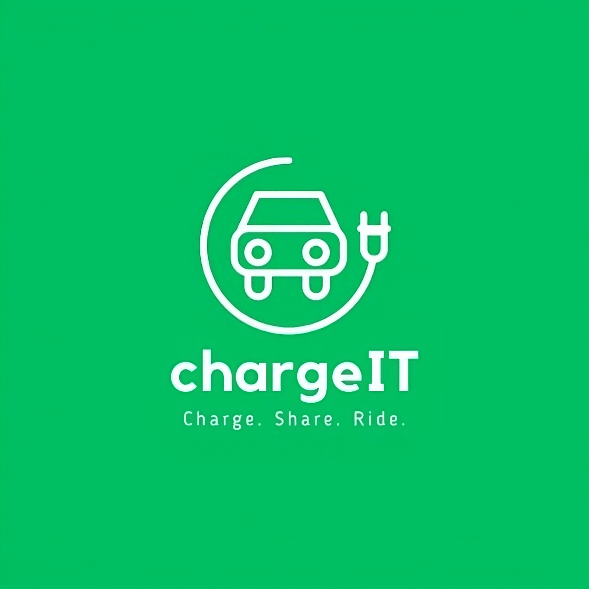

    

[Watch the Chargit Demo on YouTube](https://www.youtube.com/watch?v=hjeJv8PBJzk)  

Chargit is an app that helps electric vehicle (EV) owners find and navigate to the nearest charging station. Chargit provides a user-friendly interface to locate charging stations, view station details, and navigate to the stations. This project is aimed at improving the user experience of EV owners while using a charging station.

## Getting Started

To use Chargit, users can download the app from the App Store or Google Play. Once the app is downloaded and installed, users can create an account and sign in. The app will then ask for permission to access the user's location. It is important to grant permission as it will help the app to locate the nearest charging stations. After granting permission, the app will display a map with charging stations in the vicinity of the user's location.

## Features

The following are the features of Chargit:

- Search: Users can search for charging stations based on location, station name, or station ID. The app will display a list of charging stations that match the search criteria.
- Station Details: Users can view the details of a charging station such as the charging rate, availability, number of charging ports, and the type of charger.
- Reviews and Ratings: Users can leave a review and rating for a charging station. These reviews and ratings will help other users to make informed decisions while selecting a charging station.
- Navigation: Users can use the app to navigate to the selected charging station.
- Notification: Users can enable notifications to receive alerts when a charging station becomes available.
- Favorites: Users can save their favorite charging stations for quick access in the future.
- Add a Charging Station: Users can add their own charging station to the app and make money from it. They can specify the location, charging rate, and other details of the station. Other users will be able to view and use the charging station, and the owner of the station will receive payment for the electricity used.

## Technology

Chargit is built using React Native, a popular framework for building mobile apps. The app uses Google Maps API to display the charging stations on the map and to provide navigation directions. The backend of the app is built using JAVA spring boot and MongoDB.

## ChargeSimulator Git Project

The backend of the app communicates with the [ChargeSimulator](https://github.com/AmirMizrahi/ChargeSimulator) server, which simulates interactions with charging stations.

## Contributing

Contributions to the Chargit project are welcome. If you find any issues or have any suggestions for improvement, please create a GitHub issue or pull request.

## License

All rights reserved. This project is proprietary and confidential. No part of this project, including the source code, may be reproduced, modified, or distributed without the express written consent of the project maintainer.

## Contact

If you have any questions or feedback, please send an email to the project maintainers at:
- eden.natanzon@gmail.com
- amirmiz33@gmail.com
- orilb67@gmail.com
- valeryg2105@gmail.com
